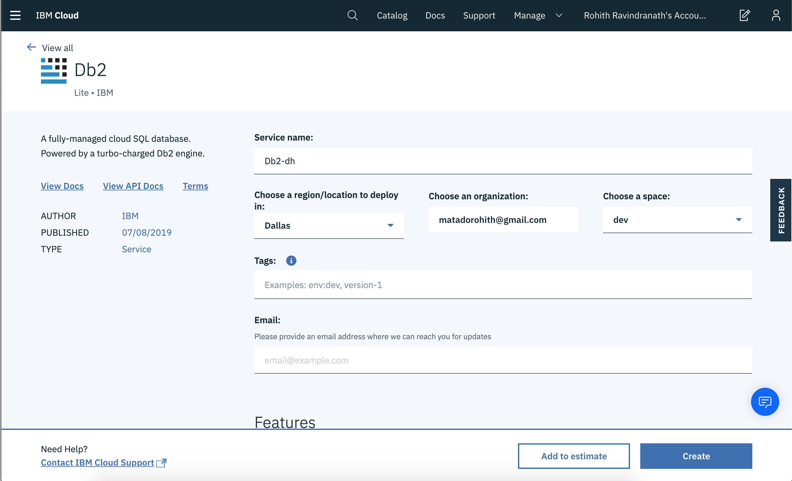
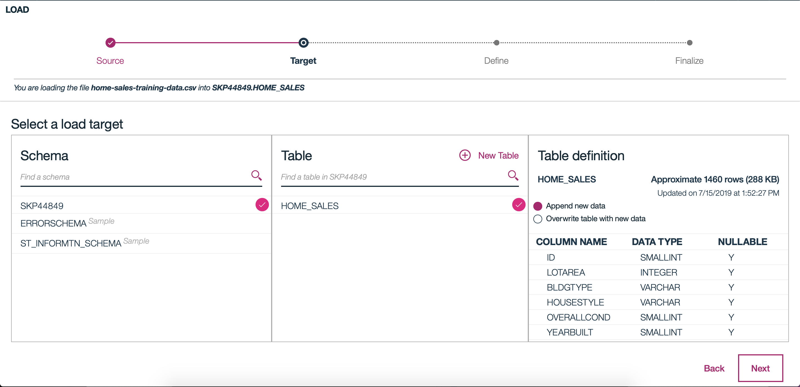

# Create A Machine Learning Modeling Using IBM Watson Studio and IBM Db2 On Cloud

This code pattern will demonstrate a data scientist's journey in creating a machine learning model using IBM Watson Studio and IBM Db2 On Cloud. We will showcase how to these products work together seamlessly to create a more enjoyable expierence. 

## Flow

## Steps

1. [Clone The Repo](#1-clone-the-repo)
2. [Create an IBM Cloud Account](#2-create-an-ibm-cloud-account)
3. [Load Data into IBM Db2 on Cloud](#3-load-data-into-ibm-db2-on-cloud) 
4. [Setup Watson Studio Project](#4-setup-watson-studio)
5. [Make Machine Learning Model](#5-make-machine-learning-model)  


### 1. Clone The Repo
Before we start anything, we need to clone the repo. The repo has our dataset and  python notebook which we will use when creating our model.

```bash
git clone https://github.com/rohithravin/MachineLearningWithWatsonAndDB2.git
```

### 2. Create an IBM Cloud Account

Go to the link below and create a free IBM on Cloud Account.

[IBM Cloud](https://cloud.ibm.com)

Creating this account will give us access to create a Db2 on Cloud and Watson Studio service. 

### 3. Load Data into IBM Db2 on Cloud
Now that we have created our IBM Cloud account. We need to create a Db2 on Cloud service. Once we have create that, we will then we able to load our data into our database. 

1. [Create Db2 on Cloud Service](#3a-create-db2-on-cloud-service)
2. [Load Data into Db2 on Cloud](#3b-load-data-into-db2-on-cloud)

#### 3a. Create Db2 on Cloud Service
Head to the [dashboard](https://cloud.ibm.com) of your IBM Cloud account and the follow the steps to create your Db2 On Cloud service.


* In the search bar at the top of your dashboard, search `Db2`.
* Although there are different database options to choose from, for the purposes of this tutorial we will be using the the `Db2` option. Click `Db2` when that option appears in the search bar.




* For the service name, enter in `Data-Science-Track`.
* Make sure you pick the region that is closest to where you currently reside.
* Scroll down to the `Pricing Plan` section and choose the `Lite` plan. 
* Click `Create`

IMPORT NOTE: In some cases you may not be able to create your db2 instance. A warning error will pop-up telling you to create a Cloud Foundary Service. Follow the directed steps to create that service and then try to create a Db2 on Cloud Service again. 

Once you created your database instance, we can head back to the dashboard and click on the `View Resources` link under the `Resource Summary` section. You should then be able to see and verify that your Db2 instance has been created under the `Cloud Foundary Services` tab.  

#### 3b. Load Data into Db2 on Cloud

Head to the dashboard of your IBM Cloud account and the follow the steps to load  your data onto Db2 On Cloud service.

* In the search bar, search `Data-Science-Track` and click on your Db2 on Cloud service


* Click on `Open Console` which will direct you to the Db2 on Cloud Console.
* Click on `Load` under the Hamburger menu.
* Click on `browse files` and select `home-sales-training-data.csv` from your computer. 
* Click `Next`.




* The next step is to decide where our data will be stored. Click on the first schema that shows up, then select `New Table`.
* Let's enter in `HOME_SALES` as our table name and select `Create` and finally `Next`.
* Now we need to finailze the table, and make sure the column names are correct. Everything should we correct, so let's go ahead and click `Next`. 
* Finally, we need to set the number of errors the load function should handle before the operation fails. For now the default number is 1000, so let's go head and click `Begin Load`.

Once the job has been completed, our data has finally been loaded into our database.

### 4. Setup Watson Studio
Setting up our project enivorment can be broken down in the follow steps.

1. [Acquiring Db2 on Cloud Credentials](#4a-acquiring-db2-on-cloud-credentials)
2. [Creating Watson Studio Service](#4b-creating-watson-studio-service)
3. [Creating a Project](#4c-creating-a-project)
4. [Connect Db2 on Cloud with Watson Studio](#4d-connect-db2-on-cloud-with-watson-studio)

#### 4a. Acquiring Db2 on Cloud Credentials

Before we create a Watson Studio service, we need to first create credentials for our database so that Watson Studio can connect to it. 


* In the search bar, search `Data-Science-Track` and click on your Db2 on Cloud service
* Click on `Service Credentials` on the left hand side.
* Click on `New Credentials` and then `Add`. This will create new credentials for us. 

The key information that is important for us is: 

1. `HOSTNAME`
2. `UI`
3. `PWD`
4. `DATABASE `

#### 4b. Creating Watson Studio Service

* Now that we have this information, we can go ahead and create our Watson service. In the search bar, search `Watson Studio` and click on that option.


 
* Make sure all the information is correct that you have selected the `Lite` plan. 
* Then click `Create` and then `Get Started`. 

This will redict you to the Watson Studio homepage. 

#### 4c. Creating a Project

Let's now create and setup our project.


* Select `Create a Project` and then select `Standard`.
* Before we can create this project, we will need to create a storage service. Scroll down and click `Add` under the `Define Storage` section. Follow the instructions and create the service. Make sure your choose the `Lite` plane. Then come back to projct creation page and refresh it. You should see your storage service now. 
* Let's name the project `Data Science Track`.
* Then click `Create`.

This will take you to your project dashboard/homepage.

#### 4d. Connect Db2 on Cloud with Watson Studio

Now that we have created out project, it's time to connect our project with our database we can use the data stored there for our machine learning project.

* On the top of the project homepage, select `Add to project` and then click `Connection`.
* This will then show us all the connections that we can have when using Watson Studio. For this project we want to use the `Db2` connection opton. So lets go and click that. 


* This will take you to a connection configuration page. Here we will enter in our Db2 credentials that we arquire from Step 4a. Make sure for the `Port` option, you use `50000`. 
* Click `Create` once you have entered all the required information.

This will redirect you to the asset page for this project, and you should see your new Db2 connection as one of the assets. 

Now that we have our database connected to our project, we need to also connect our data that is stored in our database to the project as well. 

* On the top of the project homepage, select `Add to project` and then click `Connected data`.
* Select `Select Source`.


* Select our database, scheme and finally our table `Home_Sales`. 
* Click `Select`.
* Let's name this connected data as `Home_Sales` and then click `Select`.

We have finally created our Watson Studio service. Within that, created a project where our database and data are connected. We can now finally start coding and building our model!

### 5. Make Machine Learning Model

It's time to finally create our machine leanring model! 

* On the top of the project homepage, select `Add to project` and then click `Notebook`.


* You can name the notebook whatever you want :) 
* You can either create a new notebook and copy the code from the notebook that is in github repo. Or you can import the notebook in this github repo into your project by using the `From File` option and follow along. 

If you are not able to view the python notebook through github, please use this [link](https://nbviewer.jupyter.org/github/rohithravin/MachineLearningWithWatsonAndDB2/blob/master/WML%20DB2.ipynb).

**IMPORTANT NOTE**: In the second code snippet of the notebook, make sure you change the configuration string to import your data into your python notebook.


## Learn more

* **Artificial Intelligence Code Patterns**: Enjoyed this Code Pattern? Check out our other [AI Code Patterns](https://developer.ibm.com/technologies/artificial-intelligence/)

## License

This code pattern is licensed under the Apache License, Version 2. Separate third-party code objects invoked within this code pattern are licensed by their respective providers pursuant to their own separate licenses. Contributions are subject to the [Developer Certificate of Origin, Version 1.1](https://developercertificate.org/) and the [Apache License, Version 2](https://www.apache.org/licenses/LICENSE-2.0.txt).

[Apache License FAQ](https://www.apache.org/foundation/license-faq.html#WhatDoesItMEAN)
