# Use IBM Watson Studio and Db2 On Cloud to create a machine learning model to predict home value

Data keeps on growing and extracting meaningful information out of that data is very important. Using machine learning models from the existing data helps a company to not only extract meaningful insights but also predict future results.

This code pattern will demonstrate a data scientist's journey in creating a machine learning model using IBM Watson Studio and IBM Db2 On Cloud. The pattern uses Jupyter notebook to connect to the Db2 database and uses a machine learning algorithm to create a model which is then deployed to IBM Watson machine learning service. This deployed model can now be used by exposing an API and use the input data to the API to predict the home value.

## Flow

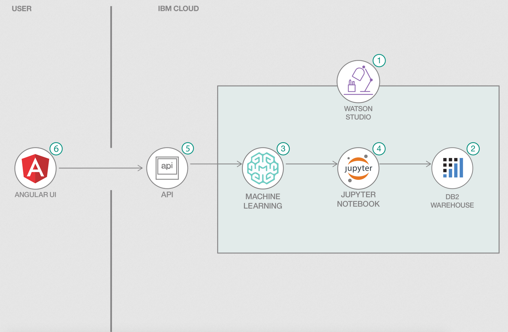

1. Create a Watson Studio Project on IBM Cloud.
1. IBM DB2 on Cloud database stores information that will be used for machine learning and predictions.
1. Watson Machine Learning helps to create ML models so that new predictions can be run against the model.
1. Jupyter notebook uses IBM Db2 on Cloud and Watson Machine Learning to create the machine learning model.
1. The model is exposed through an API
1. Angular UI uses the API to send new data for predictions

## Steps

1. [Clone the repo](#1-clone-the-repo)
2. [Create an IBM Cloud account](#2-create-an-ibm-cloud-account)
3. [Load data into IBM Db2 on Cloud](#3-load-data-into-ibm-db2-on-cloud)
4. [Setup Watson studio project](#4-setup-watson-studio-project)
5. [Creating and deploying a machine learning model](#5-creating-and-deploying-a-machine-learning-model)
6. [Testing using UI](#5-testing-using-ui)

### 1. Clone the repo

Before we start anything, we need to clone the repo. The repo has our dataset and python notebook which we will use when creating our model.

```bash
git clone https://github.com/IBM/predict-home-value-using-watson-machine-learning-and-db2.git
```

### 2. Create an IBM Cloud account

Create a free IBM on Cloud Account if you don't already have one using the following link:

[IBM Cloud](https://cloud.ibm.com)

Creating this account will give us access to `Db2 on Cloud` and `Watson Studio` services.

### 3. Load data into IBM Db2 on Cloud

Now that we have created our IBM Cloud account. We need to create a Db2 on Cloud service. Once we have create that, we will then we able to load our data into our database.

1. [Create Db2 on Cloud Service](#3a-create-db2-on-cloud-service)
2. [Load Data into Db2 on Cloud](#3b-load-data-into-db2-on-cloud)

#### 3a. Create Db2 on Cloud Service

Go to the [dashboard](https://cloud.ibm.com) of your IBM Cloud account and follow the steps to create your Db2 On Cloud service.

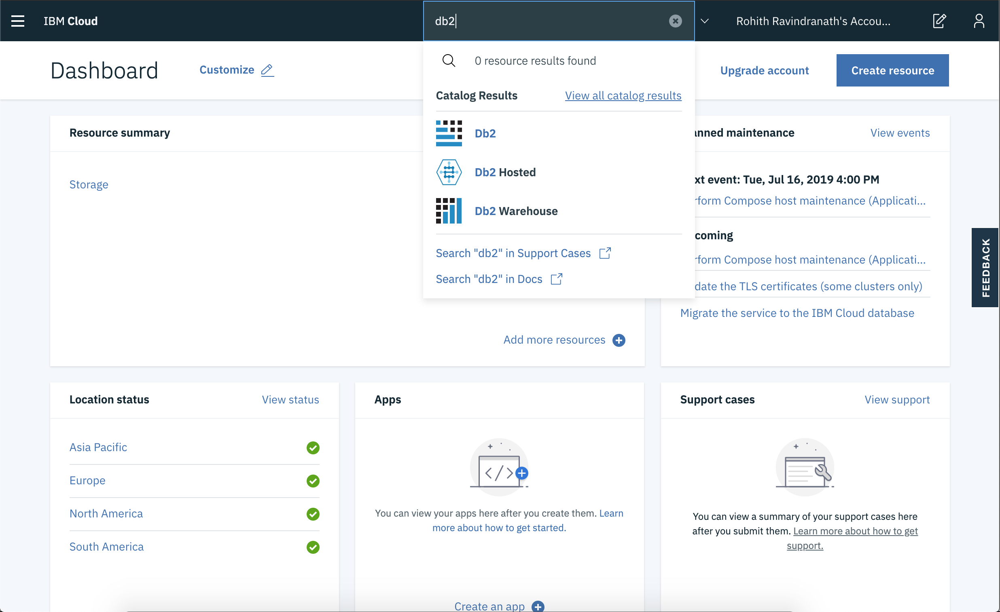

* In the search bar at the top of your dashboard, search `Db2`.
* Although there are different database options to choose from, for the purposes of this tutorial we will be using the `Db2` option. Click `Db2` when that option appears in the search bar.


* For the service name, enter in `Data-Science-Track`.
* Make sure you pick the region that is closest to where you currently reside.
* Scroll down to the `Pricing Plan` section and choose the `Lite` plan.
* Click `Create`

>NOTE: You will be only able to create one instance per account.

Once you have created your database instance, we can go back to the dashboard and click on the `View Resources` link under the `Resource Summary` section. You should then be able to see and verify that your Db2 instance has been created under the `Cloud Foundry Services` tab.  

#### 3b. Load Data into Db2 on Cloud

Go to the dashboard of your IBM Cloud account and follow the steps to load your data onto Db2 On Cloud service.

* In the search bar, search `Data-Science-Track` and click on your Db2 on Cloud service

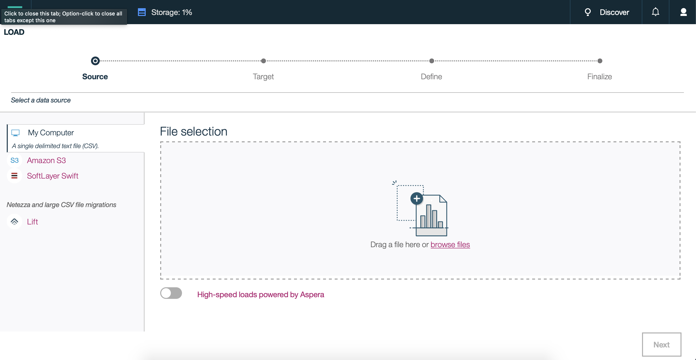

* Click on `Open Console` which will direct you to the Db2 on Cloud Console.
* Click on `Load` under the Hamburger menu.
* Click on `browse files` and select `home-sales-training-data.csv` from your computer.
* Click `Next`.


* The next step is to decide where our data will be stored. Click on the first schema that shows up, then select `New Table`.
* Enter `HOME_SALES` as our table name and select `Create` and finally `Next`.
* Make sure the column names and datatypes are correct, and click `Next`.
* Click `Begin Load`.

Once the job has been completed, our data has finally been loaded into our database.

### 4. Setup Watson Studio project

Setting up our project enivorment can be broken down in the follow steps.

1. [Get Db2 on Cloud credentials](#4a-get-db2-on-cloud-credentials)
2. [Creating Watson Studio service](#4b-creating-watson-studio-service)
3. [Creating a Watson Studio project](#4c-creating-a-watson-studio-project)
4. [Connect Db2 on Cloud with Watson Studio](#4d-connect-db2-on-cloud-with-watson-studio)

#### 4a. Get Db2 on Cloud credentials

Before we create a Watson Studio service, we need to first create credentials for our database so that Watson Studio can connect to it.

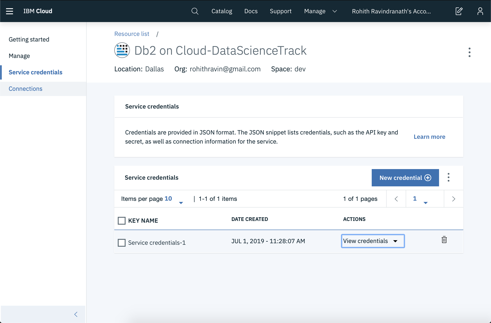

* In the search bar, search `Data-Science-Track` and click on your Db2 on Cloud service
* Click on `Service Credentials` on the left hand side.
* Click on `New Credentials` and then `Add`. Make sure to save the credentials for later use.

The key information that is important for us is:

1. `HOSTNAME`
2. `UI`
3. `PWD`
4. `DATABASE`

#### 4b. Creating Watson Studio service

* Go to Catalog and search for  `Watson Studio` and click on that option.

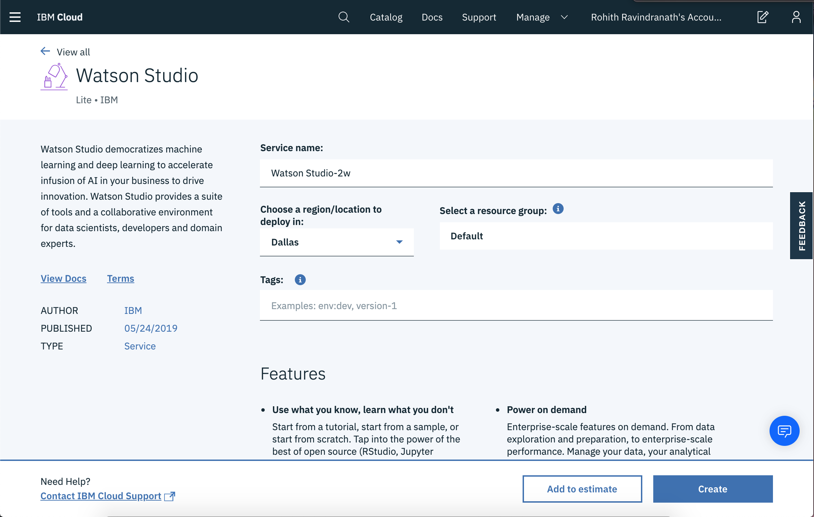

* Fill out all the fields and choose 'Lite' plan.
* Click `Create` and then `Get Started`.

This will redirect you to the Watson Studio homepage.

#### 4c. Creating a Watson Studio project

Let's now create and setup our project.

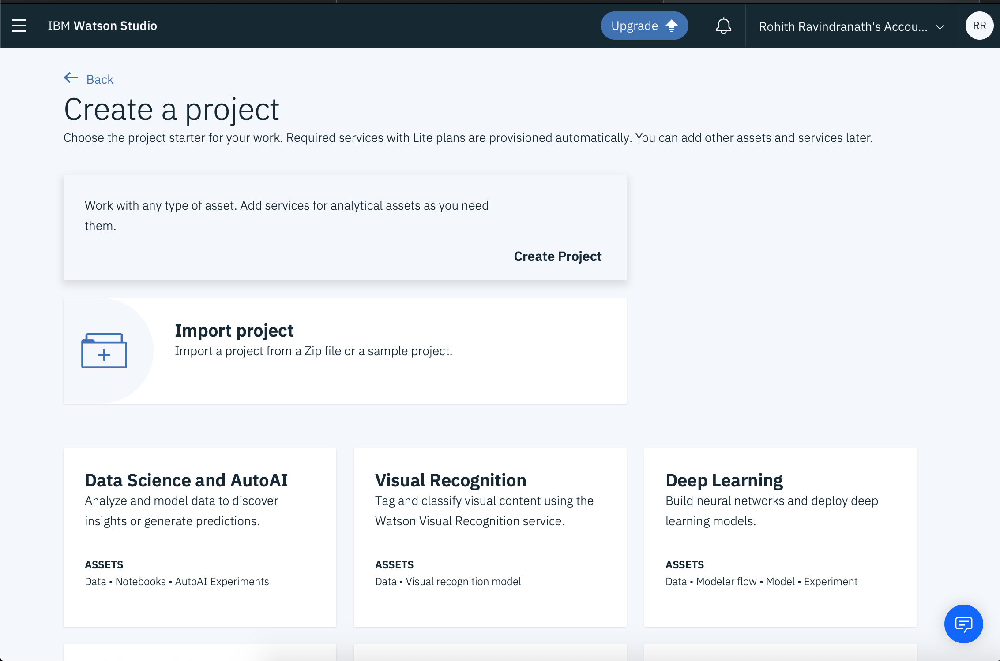

* Select `Create a Project` and then select `Standard`.
* If you haven't created object storage earlier, go to the bottom of the page and click the link `Cloud Object Storage`. Choose the `Lite` plan and click `Create`.
* Go back to the project page and make sure to choose the Cloud Object Storage that you have created earlier.
* Fill out the project details and click `Create`.

This will take you to your project dashboard/homepage.

#### 4d. Connect Db2 on Cloud with Watson Studio

* On the top of the project homepage, select `Add to project` and then click `Connection`.
* Select  `Db2` connection opton.

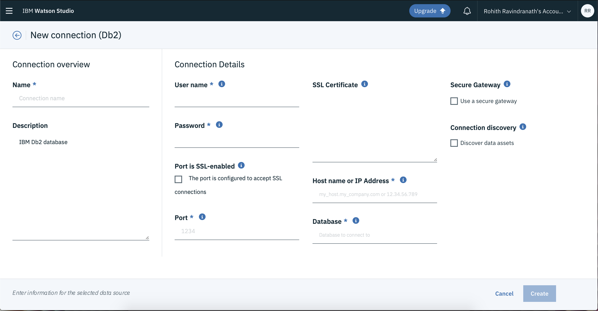

* This will take you to a connection configuration page. Here, we will enter the Db2 credentials that we got from Step 4a. Make sure to use `50000` for the `Port` option.
* Click `Create` once you have entered all the required information.

This will redirect you to the asset page for this project, and you should see your new Db2 connection as one of the assets.

Now that we have our database connected to our project, we need to also connect our data that is stored in our database to the project as well.

* On the top of the project homepage, select `Add to project` and then click `Connected data`.
* Select `Select Source`.

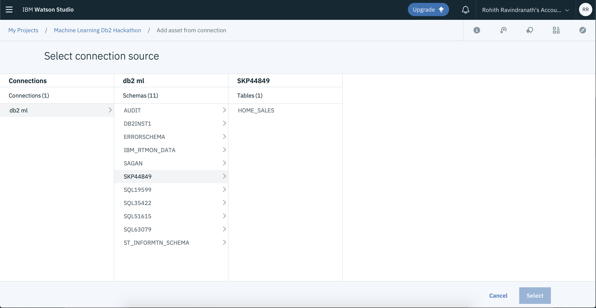

* Select our database, scheme and finally our table `HOME_SALES`.
* Click `Select`.
* Let's name this connected data as `HOME_SALES` and then click `Select`.

We have finally created our Watson Studio service. Within that, created a project where our database and data are connected. We can now finally start coding and building our model!

### 5. Creating and deploying a machine learning model

* On the top of the project homepage, select `Add to project` and then click `Notebook`.


* Fill out the notebook details
* Select `From URL` option from the tab and paste the following link to Notebook URL field:
`https://raw.githubusercontent.com/IBM/predict-home-value-using-watson-machine-learning-and-db2/master/notebooks/WML%20DB2.ipynb`

Before we run the notebook, we need to create `Watson Machine Learning` instance so that we can deploy the model to Watson Machine Learning on IBM Cloud. Here are the steps:

* Go to IBM cloud dashboard and click `Create Resource`
* Search for `machine learning` and select `Machine Learning` service
* Fill out the details, select `Lite` plan and click `Create`.

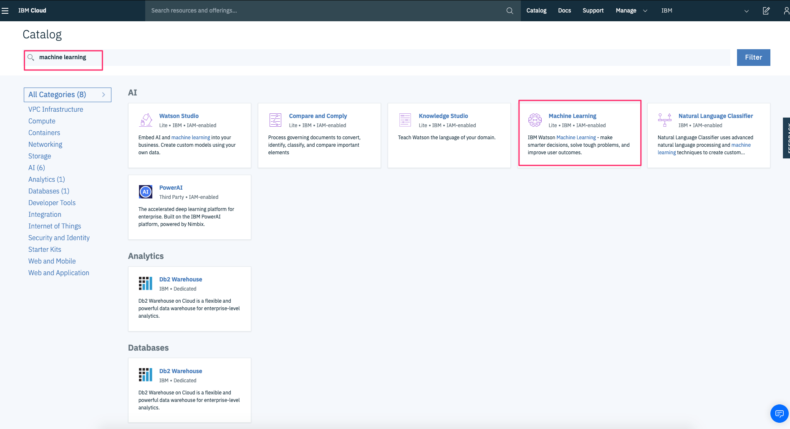

* And finally Create `Service Credentials` as shown below

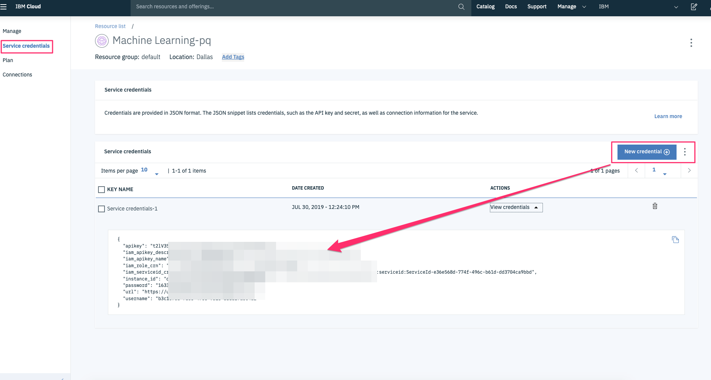

In the notebook, after the `import` cell, add cell to create connection as shown below.

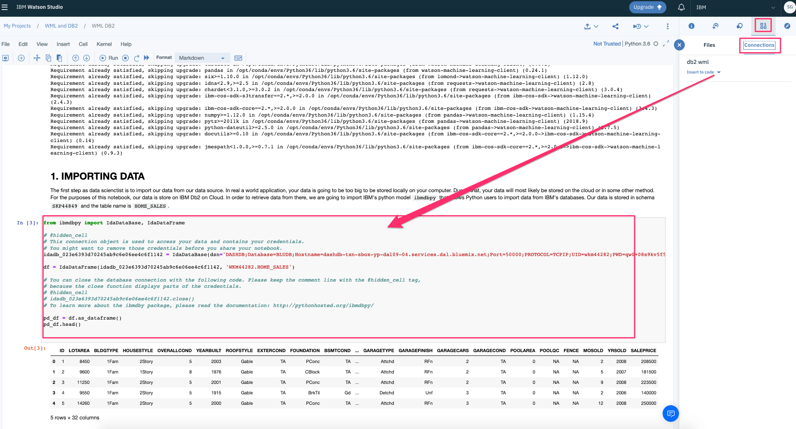

Add Watson Machine Learning service credentials that you have saved from above, at step 5 of the notebook as shown below.

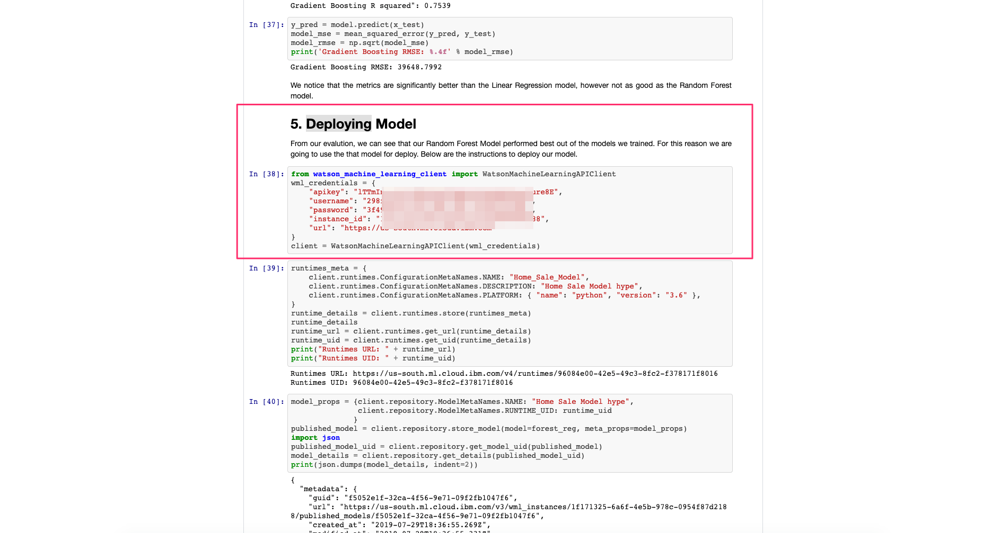

Then, run all the cells. At the end of the run the model will be deployed using Watson Machine Learning on IBM Cloud so that you could use the same model to predict home value using an API exposed through Watson Machine Learning service.

### 5. Testing using UI

* Run the code from the github URL:

`https://github.com/IBM/crud-using-nodejs-and-db2`

* Replace the value of `GO_DB2_API: 'https://<url>',` in `src/enviornments/enviornment.ts` with the API URL of your go server whcih would be `http://localhost:8080/predict`

* Click `Predict` from the navigation bar on top right.

* Fill out the details, Choose `Predict using Watson Machine Learning` in Predict Options and click `Submit`.

* Analyze the prediction result.

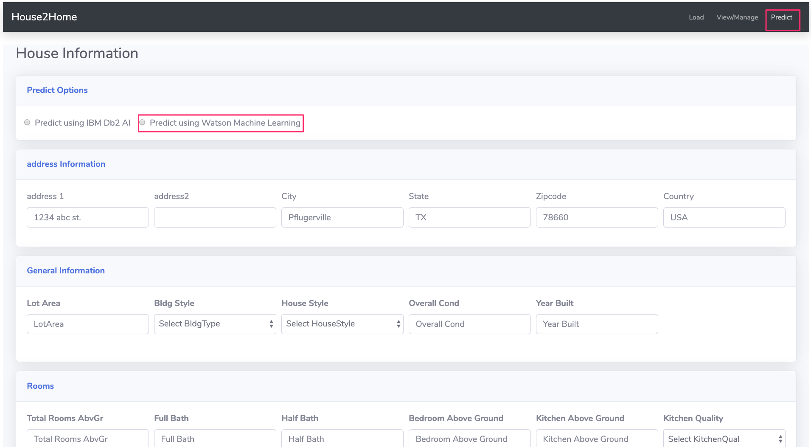


## Learn more

* **Artificial Intelligence Code Patterns**: Enjoyed this Code Pattern? Check out our other [AI Code Patterns](https://developer.ibm.com/technologies/artificial-intelligence/)

## License

This code pattern is licensed under the Apache License, Version 2. Separate third-party code objects invoked within this code pattern are licensed by their respective providers pursuant to their own separate licenses. Contributions are subject to the [Developer Certificate of Origin, Version 1.1](https://developercertificate.org/) and the [Apache License, Version 2](https://www.apache.org/licenses/LICENSE-2.0.txt).

[Apache License FAQ](https://www.apache.org/foundation/license-faq.html#WhatDoesItMEAN)
